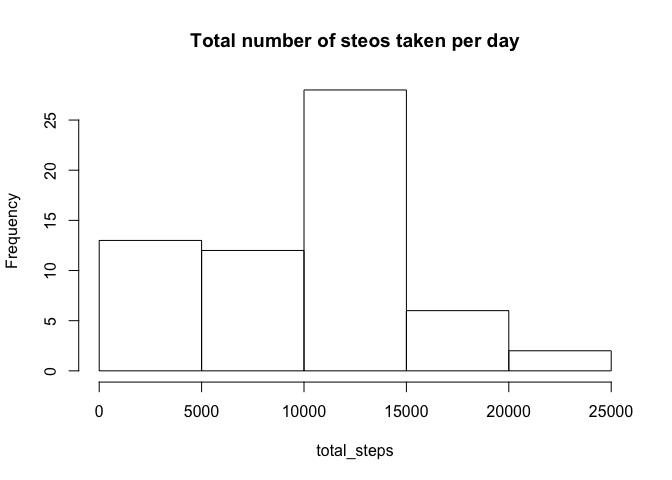
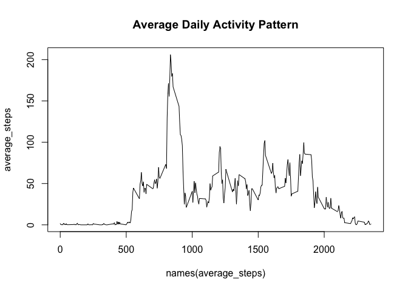
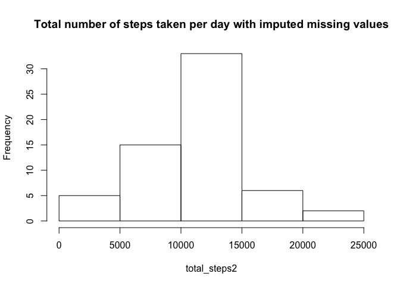
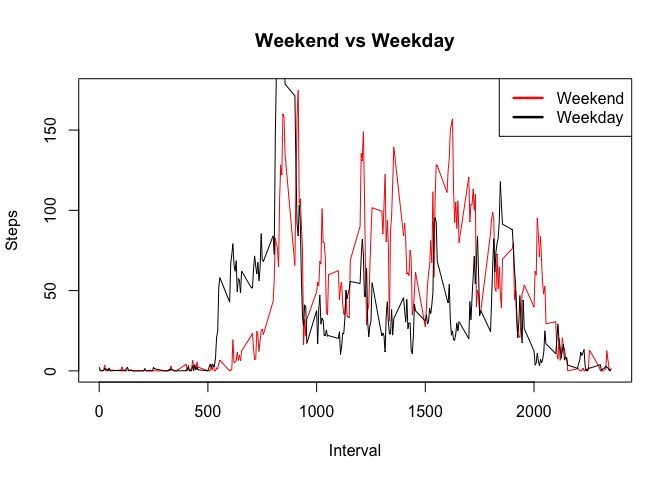

# Reproducible Research: Peer Assessment 1


## Loading and preprocessing the data

```r
activity <- read.csv("activity.csv")
```

## What is mean total number of steps taken per day?

```r
total_steps<- tapply(activity$steps, activity$date, sum, na.rm=T)

hist(total_steps, main= "Total number of steos taken per day")
```

 

```r
mean(total_steps)
```

```
## [1] 9354.23
```

```r
median(total_steps)
```

```
## [1] 10395
```
The mean total number of steps taken per day is 9354.2295082
## What is the average daily activity pattern?

```r
average_steps<- tapply(activity$steps, activity$interval, mean, na.rm=T)
plot(y=average_steps, x= names(average_steps),type="l", main="Average Daily Activity Pattern")
```

 

```r
names(which.max(average_steps))
```

```
## [1] "835"
```
On average across all the days in the datasets, 835 contains the maximum number of steps
## Imputing missing values
To calculate the total number of missing values in the dataset, we could use filter out the complete cases

```r
dim(activity)[1] -sum(complete.cases(activity))
```

```
## [1] 2304
```
We can use the generate a random number to fill in the missing values

```r
activity2 <- activity
#total_steps<- tapply(activity$steps, activity$date, sum, na.rm=T)
mean_steps <- tapply(activity2$steps, activity2$interval, mean, na.rm=T)
activity2$interval_index <- rep(0,length(activity$steps))

miss_imp <- function(var){
   missing <- is.na(var)
   n.missing <- sum(missing)
   var.obs <- var[!missing]
   imputed <- var
   imputed[missing] <- sample(var.obs,n.missing, replace=T)
   return(imputed)
}

activity2 <-activity
activity2$steps_imp <- miss_imp(activity2$steps)
total_steps2<- tapply(activity2$steps_imp, activity2$date, sum)
hist(total_steps2, main= "Total number of steps taken per day with imputed missing values")
```

 

```r
mean(total_steps2)
```

```
## [1] 10719.92
```

```r
median(total_steps2)
```

```
## [1] 10765
```
The mean and median both rise.

## Are there differences in activity patterns between weekdays and weekends?


```r
activity2$date <-as.Date(activity2$date)
activity2$weekday <- weekdays(activity2$date)
activity2$weekend <- ifelse(activity2$weekday=="Saturday",1,ifelse(activity2$weekday=="Sunday",1,0))
weekenddata <- activity2[activity2$weekend==1,]
weekdaydata <- activity2[activity2$weekend==0,]

average_steps_weekend<- tapply(weekenddata$steps, weekenddata$interval, mean, na.rm=T)
average_steps_weekday<- tapply(weekdaydata$steps, weekdaydata$interval, mean, na.rm=T)

par(mfrow=c(1,1))

y1 <- as.numeric(unlist(average_steps_weekend))
x1 <- names(average_steps_weekend)
plot(y=y1, x= x1,type="l", main="Weekend vs Weekday",xlab="Interval",ylab="Steps",col="red")
y2 <- as.numeric(unlist(average_steps_weekday))
lines(x1,y2,col="black")
legend("topright",c("Weekend","Weekday"), lty=c(1,1), lwd=c(2.5,2.5),col=c("red","black"))
```

 
Yes, people tend to walk more weekday than on weekend in general. My Rstudio has a small margin so I plot the two patterns on the same graph :)
